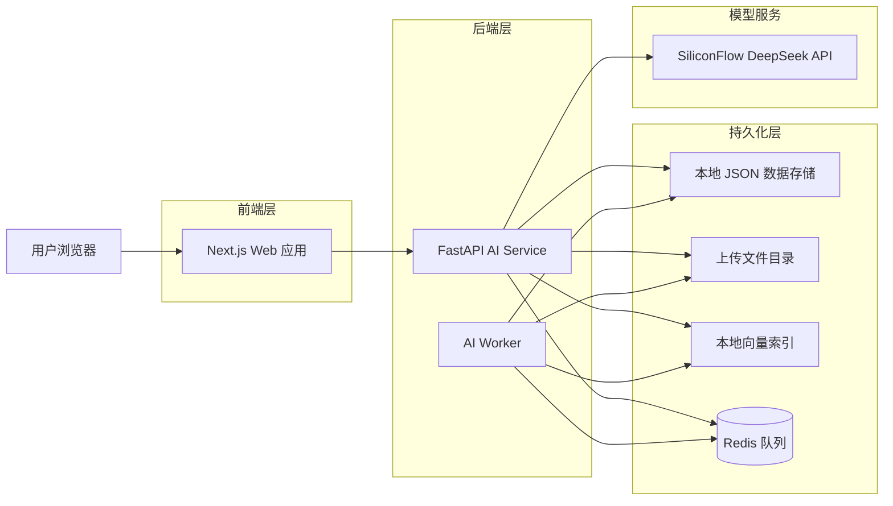
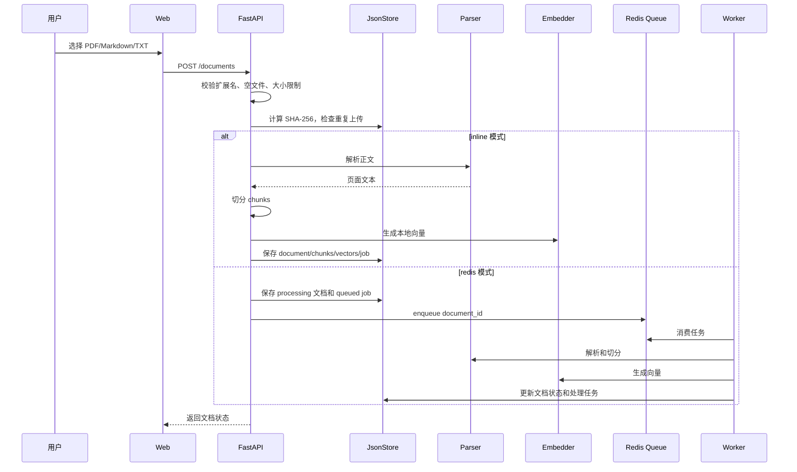
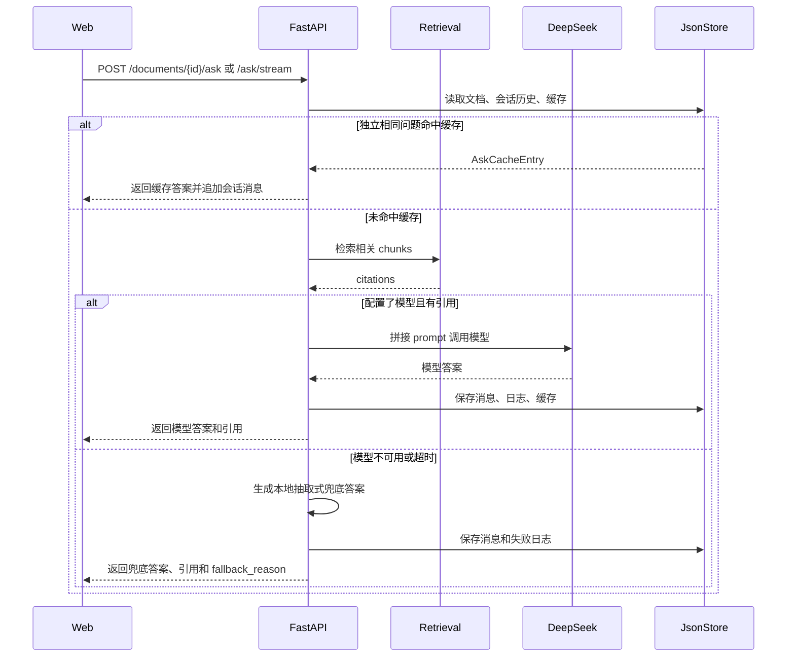
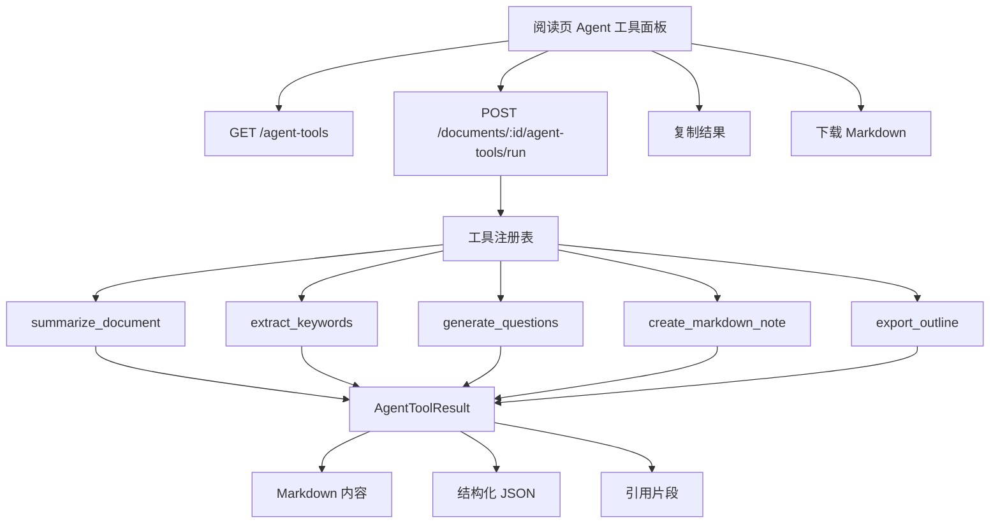

# PaperMind 系统架构

本文档用于说明 PaperMind 的系统边界、模块职责和主要业务链路，适合在作品集、面试讲解和后续重构时使用。

## 总体架构

## 模块职责

| 模块 | 路径 | 职责 |
| --- | --- | --- |
| Web 应用 | `apps/web` | 文档库、上传、阅读页、问答、日志页、Agent 工具面板 |
| AI Service | `services/ai-service/app/main.py` | HTTP API、上传校验、文档处理、RAG 问答、工具调用 |
| 文档解析 | `parser.py` | PDF/Markdown/TXT 解析、正文清洗、文本切分 |
| 检索 | `retrieval.py` | 关键词和本地向量混合检索、引用片段构建 |
| 模型调用 | `llm.py` | DeepSeek 请求、流式输出、超时重试、Token 和费用估算 |
| 文档洞察 | `analyzer.py` | 本地摘要、关键词、提纲、建议追问 |
| Agent 工具 | `agent_tools.py` | 工具注册表、统一执行入口、Markdown 和结构化结果生成 |
| 存储 | `storage.py` | 本地 JSON 数据读写、上传文件、向量、缓存、日志 |
| 工程化 | `engineering.py` | 统一错误返回、请求 ID、日志、限流 |
| 队列 | `queue.py` / `worker.py` | Redis 异步文档处理任务 |

## 文档上传和解析链路

## RAG 问答链路

## Agent 工具链路

## 工程化能力

- 统一错误返回：所有 HTTP 异常返回 `detail` 和 `error.code/message/request_id`。
- 请求可追踪：每个请求都有 `x-request-id`，日志中同步记录。
- 限流：按客户端 IP 做基础分钟级限流。
- 幂等上传：上传内容计算 SHA-256，重复内容直接返回已有文档。
- 解析重试：文档处理任务记录 attempts、状态和失败原因。
- 模型超时和重试：模型请求支持超时配置和失败重试。
- 模型降级：模型不可用时回退到本地抽取式回答或本地文档洞察。
- 问答缓存：独立相同问题命中缓存，同时保留当前会话历史。
- 日志和成本：记录模型状态、耗时、Token、估算费用、缓存命中。
- E2E 验证：Playwright 覆盖上传、阅读页、Agent 工具和问答主流程。

## 当前取舍

- 当前存储使用本地 JSON，适合本地演示和作品集迭代；生产环境可迁移到 PostgreSQL。
- 当前 Embedding 使用本地哈希向量，重点展示 RAG 链路；后续可替换为真实 Embedding 模型和向量数据库。
- Agent 工具当前以可测试的工具注册表为核心；后续可以增加模型计划器，让模型选择工具并串联工作流。
