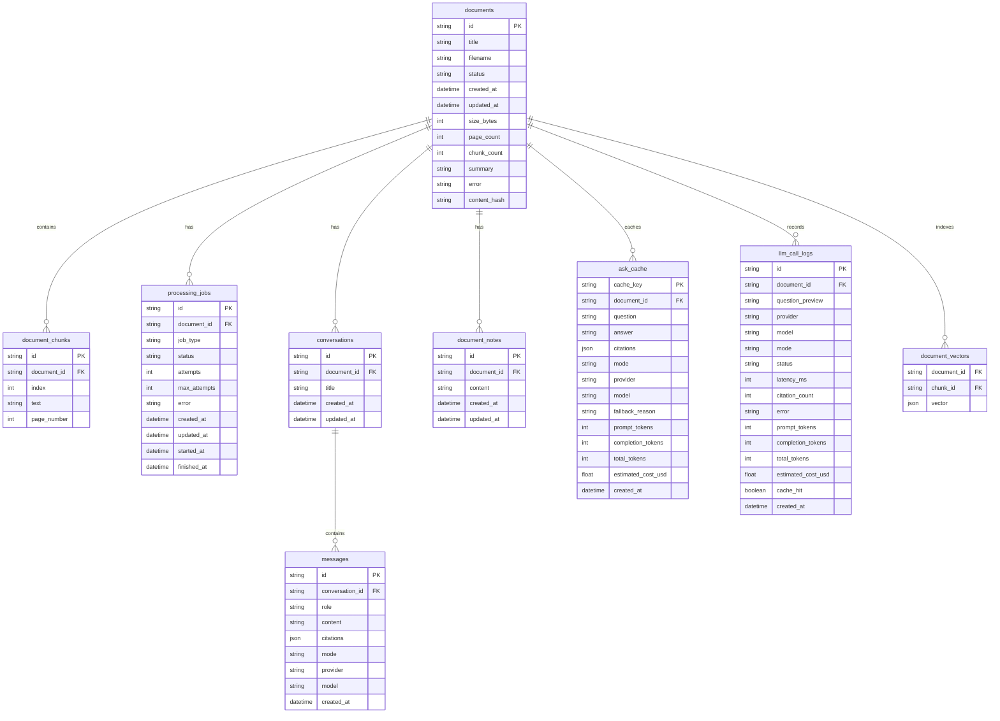

# PaperMind 数据结构设计

PaperMind 当前使用本地 JSON 文件存储数据。本文档以“逻辑数据表”的方式描述结构，便于后续迁移到 SQLite、PostgreSQL 或外部向量数据库。

## ER 图



## 逻辑表说明

### documents

文档主表，保存上传文件的元数据和处理状态。

关键字段：

- `id`：文档 ID。
- `status`：`ready`、`failed`、`processing`。
- `content_hash`：上传文件的 SHA-256，用于重复上传幂等判断。
- `page_count` / `chunk_count`：解析后的页数和片段数。
- `summary`：解析阶段生成的简短摘要。
- `error`：处理失败时的错误原因。

### document_chunks

文档切分后的正文片段，是 RAG 检索和引用展示的基础。

关键字段：

- `document_id`：所属文档。
- `index`：片段顺序。
- `text`：片段正文。
- `page_number`：PDF 页码；Markdown/TXT 可为空。

### processing_jobs

文档处理任务记录，用于展示解析进度、失败原因和重试次数。

关键字段：

- `status`：`queued`、`processing`、`succeeded`、`failed`。
- `attempts`：实际尝试次数。
- `max_attempts`：最大重试次数。
- `started_at` / `finished_at`：处理时间边界。

### conversations 和 messages

多轮问答历史。

设计要点：

- 一个文档可以有多个会话。
- 每条助手消息保存引用片段、回答模式、模型名称和 provider。
- 生成回答前会将历史消息作为上下文传入模型，过长历史会自动压缩。

### document_notes

用户手写阅读笔记。

### ask_cache

独立问题的问答缓存。

设计要点：

- `cache_key` 由 `document_id + normalized_question` 构成。
- 只缓存没有历史上下文的独立提问。
- 同一会话内的相同问题不会误用缓存，避免破坏多轮上下文。

### llm_call_logs

模型调用日志，用于排查模型失败、降级和成本。

记录内容：

- 调用状态：`success`、`skipped`、`failed`。
- 回答模式：`model` 或 `extractive`。
- Token 和估算费用。
- 是否缓存命中。
- 错误原因。

### document_vectors

文档片段向量索引。

当前实现为本地哈希向量，逻辑上可以迁移到：

- PostgreSQL + pgvector
- Qdrant
- Milvus
- Weaviate
- Elasticsearch/OpenSearch dense vector

## 文件存储映射

当前 `JsonStore` 将逻辑表保存到一个 `store.json` 文件中，上传原文件保存到 `uploads/` 目录。设计目标是简单、可演示、易迁移。

```text
data/
|-- store.json
`-- uploads/
    `-- {document_id}.{ext}
```

`store.json` 内部按 key 拆分逻辑集合：

```json
{
  "documents": {},
  "chunks": {},
  "vectors": {},
  "processing_jobs": {},
  "ask_cache": {},
  "llm_logs": [],
  "conversations": {},
  "messages": {},
  "notes": {}
}
```

## 数据生命周期

1. 用户上传文件，系统创建 `documents`。
2. 系统解析文件，生成 `document_chunks` 和 `document_vectors`。
3. 处理过程写入 `processing_jobs`。
4. 用户提问时创建或复用 `conversations`，写入 `messages`。
5. 问答结果写入 `llm_call_logs`，独立问题写入 `ask_cache`。
6. 用户保存笔记时写入 `document_notes`。
7. 删除文档时同步删除 chunks、vectors、processing jobs、conversations、messages、notes 和相关缓存。

## 后续迁移建议

- 将 `documents`、`document_chunks`、`processing_jobs`、`conversations`、`messages`、`document_notes`、`ask_cache`、`llm_call_logs` 迁移到 PostgreSQL。
- 将 `document_vectors` 迁移到 pgvector 或专用向量数据库。
- 上传文件迁移到对象存储，例如 S3、MinIO 或 OSS。
- 增加 Alembic 数据库迁移脚本。
- 为 `document_id`、`conversation_id`、`content_hash`、`cache_key` 建索引。
